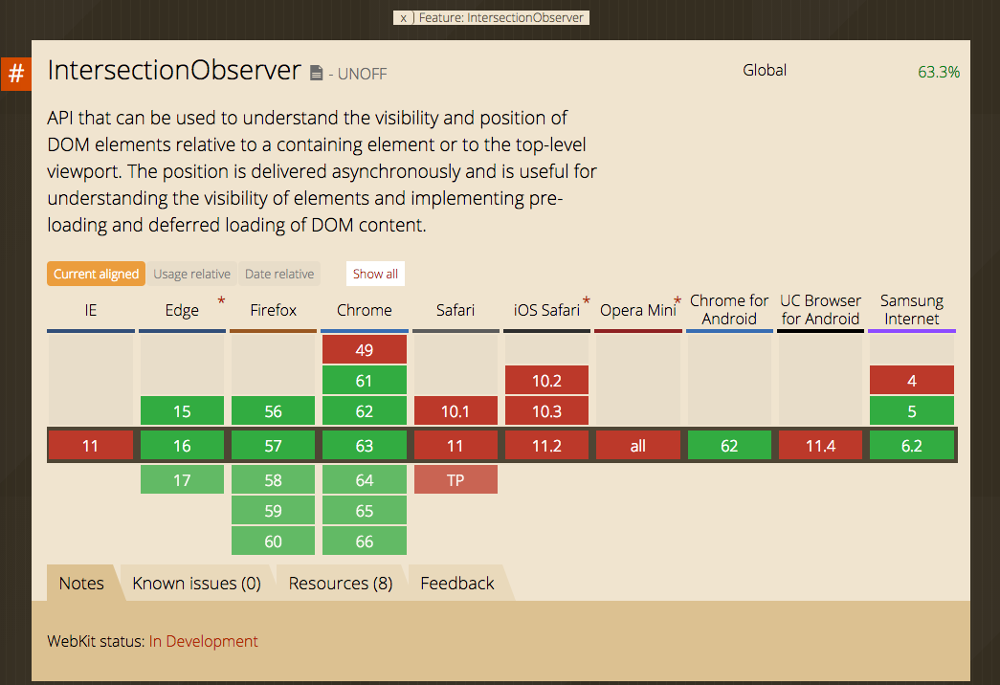

## Intersection を Observe したい

---


##### Twitter: @zaki___yama
##### ~~フロントエンドエンジニア~~ プロダクトマネージャー


---

### モチベーション


<a>2016</a>/12/19

---

### Intersection Observer

- 指定した要素同士の交差(intersection)を検知し、イベントを発火
- 従来は scroll イベントを適当に間引いてサイズや位置を計算して...
- 画像やデータの遅延ロード (lazy load) とかで使われる


---

##### https://caniuse.com/#feat=intersectionobserver



---

### 書いてみる


---

```javascript
const observer = new IntersectionObserver((changes) => {
  changes.forEach((change) => {
    console.log(change);
  });
});
const steps = document.querySelectorAll('.step');
steps.forEach((step) => {
  observer.observe(step);
});
```

@[1](IntersectionObserver クラスを生成)
@[8](監視したい DOM を指定)

---

### change の中身(抜粋)

- boundingClientRect: ターゲットの `getBoundingClientRect()`
- intersectionRect: 交差領域の `getBoundingClientRect()`
- intersectionRation: 交差領域の割合
- isIntersecting: 交差しているか
- target: ターゲット

<br />

`getBoundingClientRect()` は画面上の相対位置

---

#### なんかいろいろ面倒だな
#### 要素が画面に表示されたときと非表示になったときだけわかればいいんだけど...

---


#### [Scrollama.js](https://github.com/russellgoldenberg/scrollama)

---

こんなノリで書けるらしい（未確認）

```javascript
// instantiate the scrollama
const scroller = scrollama();

// setup the instance, pass callback functions
scroller
  .setup({
    step: '.step', // required
    offset: 0.5, // optional, default = 0.5
    debug: false // optional, default = false
  })
  .onStepEnter(handleStepEnter)
  .onStepExit(handleStepExit);
```

---

### もうひとつ

React ならこれでよさそう  
https://github.com/openfresh/viewport-observer

---

### まとめ

- なんとなく Observe できた
- Lazy Load までの道は遠い


---?image=https://blogimg.goo.ne.jp/user_image/0f/ea/f4ca07195490da63bb1b0a3cf6929005.jpg
